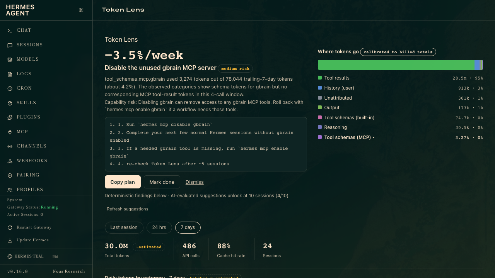
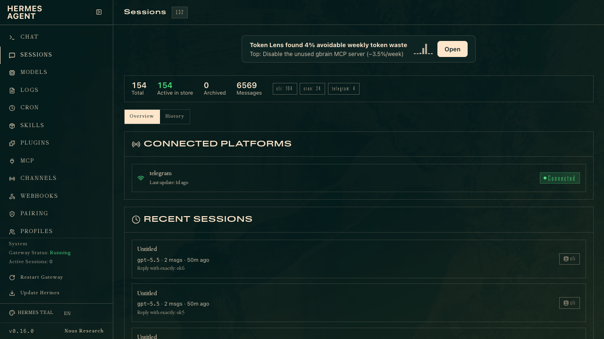

# Token Lens

Token consumption analytics + reduction suggestions for [Hermes Agent](https://github.com/NousResearch/hermes-agent).

Core Analytics tells you *how much* you spend. Token Lens tells you **where the tokens go** and **what to change** — every category bucket calibrated so it sums exactly to your billed totals, and every suggestion shipped with evidence and a copy-paste plan executable in a Hermes chat.



*The entry card on your Sessions page leads with the findings:*




## Install

```bash
git clone <repo-url> ~/.hermes/plugins/token-lens
hermes plugins enable token-lens
```

Then — **both restarts are required**:

1. **Restart the dashboard** (`hermes dashboard`): plugin API routes mount only at startup. The rescan endpoint refreshes UI discovery only.
2. **Restart any running gateway / CLI session**: recorder hooks load at process start. Until you restart, Token Lens records nothing (the dashboard will show a "Token Lens isn't recording" banner if it detects this).

Open the dashboard → **Token Lens** tab. With zero data you'll get a first-run screen offering to import your last 30 days of history (estimated attribution, honestly badged).

## What you get

- **Where tokens go** — per-call capture of exact billed usage, decomposed into stable categories: system prompt, tool schemas (built-in / per-MCP-server), skill loading, memory, history, tool results, output, reasoning. Estimated buckets are rescaled per API call so they sum exactly to billed prompt tokens.
- **Suggestions** — deterministic detectors (unused MCP servers, low cache hit rate, oversized system prompt, runaway turns) fire after 3 recorded sessions; AI-evaluated suggestions unlock at 10. Every suggestion: evidence, expected savings, capability-risk note, copy-paste plan.
- **Acted-on tracking** — mark a suggestion done and Token Lens shows predicted vs observed change (per-session category average, labeled "change since acted").
- **Honest data** — exact vs estimated precision badged everywhere; backfilled history hatched; calibration drift monitored in `/health`.

## Config (`~/.hermes/config.yaml` → `plugins.entries.token-lens.*`)

| Key | Default | Meaning |
|-----|---------|---------|
| `min_sessions` | 10 | sessions before AI suggestions unlock |
| `detector_min_sessions` | 3 | sessions before deterministic findings show |
| `refresh_every` | 5 | new sessions between suggestion refreshes |
| `max_suggestions_shown` | 5 | display cap |
| `score_threshold` | 6 | evaluator gate (0–10) |
| `evolve_rules` | true | allow category mapping-rule evolution (logged to EVOLUTION.md) |
| `backfill_window_days` | 30 | historical import window |
| `meta_budget_tokens` | 50000 | hard cap per suggestion refresh |
| `recorder_enabled` | true | master switch for the hook recorder |
| `retention_days` | 90 | per-call row retention (rollups kept forever) |

## Uninstall

```bash
hermes plugins disable token-lens
rm -rf ~/.hermes/plugins/token-lens ~/.hermes/token_lens.db
```

No core residue beyond the plugin's own DB file.

## Development

```bash
~/.hermes/hermes-agent/venv/bin/python -m pytest    # run tests
```

Architecture: two processes share `~/.hermes/token_lens.db` (WAL). The recorder (`__init__.py`) runs agent-side via hooks and never blocks the conversation loop (fail-open + circuit breaker). The dashboard API (`dashboard/plugin_api.py`) runs in the dashboard process. Shared logic lives in `token_lens_core.py`.
